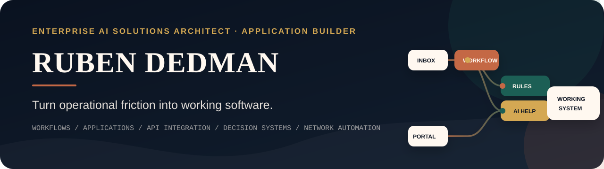

<p align="center">
  
</p>

<p align="center">
  <a href="https://rubendedman.com"></a>
  <a href="https://www.linkedin.com/in/ruben-dedman/"></a>
  <a href="mailto:rubendedman@gmail.com"></a>
</p>

<p align="center"><strong>Available for selected architecture, application, API-integration, and automation projects.</strong></p>

---

## I build the system between the problem and the result.

I am an **Enterprise AI Solutions Architect and hands-on application builder**. I turn fragmented workflows, disconnected tools, difficult knowledge, and repetitive operations into software that people can actually use.

My work sits at the intersection of:

**business operations · solution architecture · full-stack development · API integration · applied AI · network automation**

I do not lead with “AI.” I lead with the operational problem, build the application and integrations required to solve it, and use AI only where it creates measurable leverage.

<table>
  <tr>
    <td align="center" width="25%"><strong>13+ years</strong><br/><sub>IT, architecture, delivery</sub></td>
    <td align="center" width="25%"><strong>100+ use cases</strong><br/><sub>AI and automation designed</sub></td>
    <td align="center" width="25%"><strong>≈ $250K–$8B</strong><br/><sub>organization-size experience</sub></td>
    <td align="center" width="25%"><strong>US Army veteran</strong><br/><sub>mission-first execution</sub></td>
  </tr>
</table>

---

## Solutions I build

| Operating environment | Where work usually breaks | Systems I design and ship |
|---|---|---|
| **Technology & IT Services** | Incomplete intake, duplicate portal entry, weak sales-to-delivery handoffs, tribal knowledge, manual customer updates | Service operations workbenches, workflow applications, partner/customer portals, API integrations, knowledge and decision-support systems |
| **Government Contractors** | Noisy opportunity searches, slow solicitation review, disconnected capture activity, inconsistent bid/no-bid decisions | Opportunity-intelligence platforms, document-analysis pipelines, fit scoring, compliance workspaces, capture dashboards and outreach workflows |
| **Workforce Enablement** | Static content, disconnected labs and assessments, invisible weak spots, generic tutoring | Adaptive learning platforms, simulations, practice engines, instructor tools, progress analytics and curriculum-grounded AI assistance |
| **Professional & Field Services** | Incomplete intake, slow estimates, manual scheduling, scattered job evidence and status communication | Operations portals, guided intake, proposal/estimate workbenches, document workflows, customer experiences and reporting systems |

### Where AI earns its place

I use AI for work such as extraction, classification, retrieval, summarization, drafting, recommendation, natural-language interaction, and tool orchestration.

I keep pricing rules, permissions, approvals, compliance gates, irreversible actions, and other deterministic decisions under explicit software and human control.

---

## Selected solution stories

| Solution | Evidence type | What it demonstrates |
|---|---|---|
| **Government Opportunity Intelligence Platform** | Owned product | Natural-language opportunity discovery, capability matching, historical-award research, solicitation analysis, CRM/outreach workflow, PostgreSQL/pgvector and Python/FastAPI architecture |
| **AI-Assisted Network Operations Console** | Personal build / active demonstration | Network-state collection, AI-assisted recommendations, deterministic validation, human approval, NETCONF/RESTCONF execution, post-change verification and audit history |
| **Technical Workforce Enablement Platform** | Professional and product experience | Guided learning, adaptive practice, labs, CLI simulation, mastery tracking, instructor workflows and contextual AI tutoring |
| **Patient Operations Platform** | Anonymized implementation experience | Verification, intake, scheduling, backend integration, persistence, exception handling, reporting and human escalation—with voice as one interface rather than the product |
| **Content Operations System** | Product-engineering experience | Source ingestion, AI-assisted drafting, author-style controls, image processing, SEO metadata, review and publishing workflows |

<p align="center">
  <a href="https://rubendedman.com"><strong>Explore the portfolio and solution stories →</strong></a>
</p>

---

## Technology, when it earns its place

<p>
  
</p>

**Applications:** Vite, React, TypeScript, Tailwind CSS, shadcn/ui, component systems, responsive UX  
**Backend & data:** Python, FastAPI, Node.js, PostgreSQL, pgvector, Supabase, Redis, REST APIs, webhooks  
**Applied AI:** OpenAI, Anthropic, RAG, agents, MCP, evaluation, guardrails, human-in-the-loop workflows  
**Infrastructure:** Cloudflare, Docker, AWS, GCP, Linux, CI/CD, client-owned deployments  
**Network automation:** Cisco platforms and APIs, CML, Meraki, NETCONF, RESTCONF, YANG, Python automation

---

## How I work

```text
Understand the operation
        ↓
Map the workflow and constraints
        ↓
Design the application and integrations
        ↓
Use AI where it adds leverage
        ↓
Build, test and deploy
        ↓
Document, transfer and hand off cleanly
```

Every serious engagement is designed around clear scope, acceptance criteria, client-owned infrastructure, production-minded testing, and documentation that survives the project.

### Ways to work with me

- **Operational Systems Blueprint** — map the problem, users, workflow, integrations, architecture, risks, and implementation plan.
- **Application or Integration Build** — ship one defined workflow, internal tool, portal, AI-enabled application, or API integration.
- **Production System Delivery** — architect and build a multi-user operational platform with data, AI, controls, deployment, and handoff.
- **Architecture Advisory Block** — focused review, troubleshooting, technical planning, vendor selection, or implementation guidance.

---

## Selected media and teaching

### Podcasts

- [AI and DevNet: Transforming Network Operations](https://www.tdsynnex.com/na/cisco/edge360online/ai-and-devnet/)
- [Demystifying AI Implementation in IT Infrastructure](https://www.tdsynnex.com/na/cisco/edge360online/easy-ai-implementation/)
- [Building Unicorn Employees: Empowering IT Professionals](https://www.tdsynnex.com/na/cisco/edge360online/unicorn-employees/)

### Articles

- [DevNet Fundamentals: Bridging the Gap Between Networking and Development](https://www.tdsynnex.com/na/cisco/edge360online/devnet-fundamentals/)
- [Network Transformation: Embracing Automation and AI](https://www.tdsynnex.com/na/cisco/edge360online/network-transformation/)
- [Cisco DevNet and Beyond: Navigating the Future of Network Automation](https://www.tdsynnex.com/na/cisco/edge360online/cisco-devnet/)

---

## The background behind the builds

- **Enterprise solutions architecture:** translating ambiguous operational needs into practical systems and implementation plans.
- **Networking foundation:** former CCNA with deep enterprise networking and network-automation experience.
- **Technical enablement:** taught advanced Cisco automation material to engineers preparing for professional-level certification.
- **Hands-on engineering:** frontend, backend, databases, AI integrations, deployment, documentation, and client-facing delivery.
- **Outside technology:** US Army veteran, Judo brown belt, and competitive fencer.

---

## Bring me the broken workflow.

Send me:

1. What happens today
2. Which systems are involved
3. Where time, money, or attention is being lost
4. What a better operating experience should look like

<p align="center">
  <a href="https://rubendedman.com"></a>
  <a href="mailto:rubendedman@gmail.com"></a>
</p>

<p align="center">
  <sub>Professional services delivered through <strong>ProconnAI LLC</strong>, a VetCert Service-Disabled Veteran-Owned Small Business.</sub>
</p>
